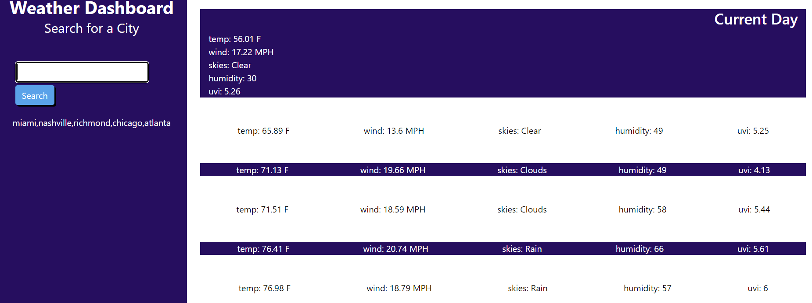

# Weather-Dashboard

## Description
A simple weather dashboard that displays the weather of the city entered for the current day and future five days. Cities entered are logged below the search bar.
The following weather data are displayed: temperature, wind speed, skies, humidity, and the UV index.

## Website
https://jreese8.github.io/Weather-Dashboard/

## Screenshot
